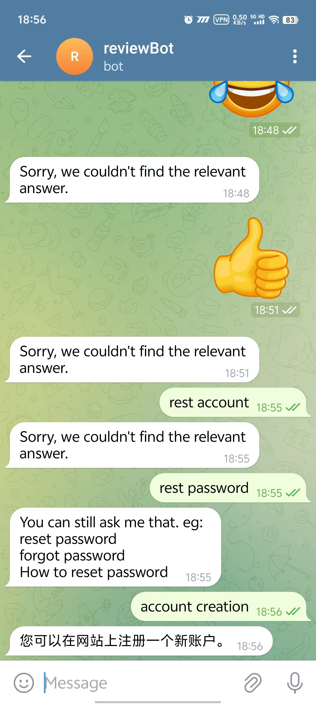
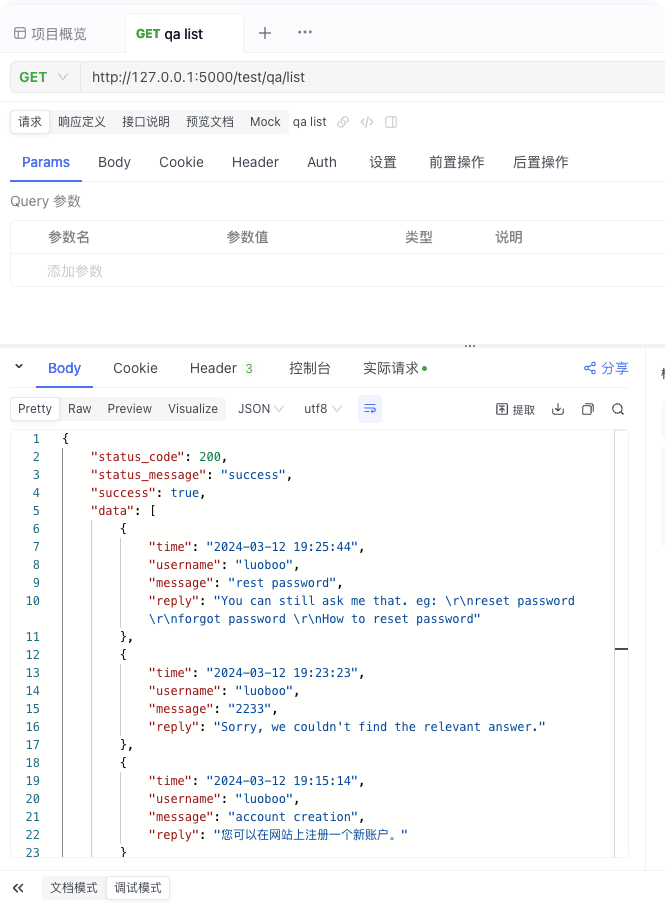

# Review Bot

## Telegram Demo
```json
{
  "questions": [
    {
      "variants": ["create an account", "how to create an account", "account creation"],
      "answer": "您可以在网站上注册一个新账户。"
    },
    {
      "variants": ["reset password", "forgot password", "How to reset password"],
      "answer": "您可以在登录页面点击“忘记密码”链接进行密码重置。"
    },
    {
      "variants": ["创建一个账号", "如何创建账号", "账号创建"],
      "answer": "您可以在网站上注册一个新账户。"
    },
    {
      "variants": ["重置密码", "忘记密码", "如何重置密码"],
      "answer": "您可以在登录页面点击“忘记密码”链接进行密码重置。"
    },
    {
      "variants": ["联系客服", "如何联系客服", "客服联系方式"],
      "answer": "您可以发送电子邮件至support@example.com联系客服。"
    }
  ]
}
```

- Telegram test


- records in db 



## Code Design
- Chatbot
  - Integration with Telegram API
``` md
  file path: 
    [api] internal/service/telegram.go
    [setup] cmd/bot.go
```
  - Utilization of Aliyun NLP service
``` md
  file path: 
    [api] internal/service/nlp.go
```
- Gather Personal Reviews from Customers
  - Saving data in MySQL
``` md
  file path: 
    [api] internal/service/qa.go
```
  - Displaying results through Postman API
``` md
  file path: 
    [api] api/qa.go
```
- Test Demo
  - Telegram Bot: [@fx_test_review_bot]


## Frameworks Design

### Frameworks Introduction
  - API: Handles API related functionality.
  - CMD Program Command Relation Run: Manages command execution for the program.
  - Config: Contains the configuration file for the program settings.
  - Database: Connects and interacts with the database.
  - Internal: Houses the core logic code of the application.
  - PKG: Collection of reusable packages or modules.
  - Router: Defines routing for different functionalities.
  - Test: Directory for test cases and demo testing.
  - main.go: The entry point of the program.
  - ngo.sh: Project scaffolding tool.

### Frameworks Run
```bash
CGO_ENABLED=0 GOOS=linux GOARCH=amd64 go build -o review-bot main.go

nohup ./review-bot > review-bot.log 2>&1 &
```